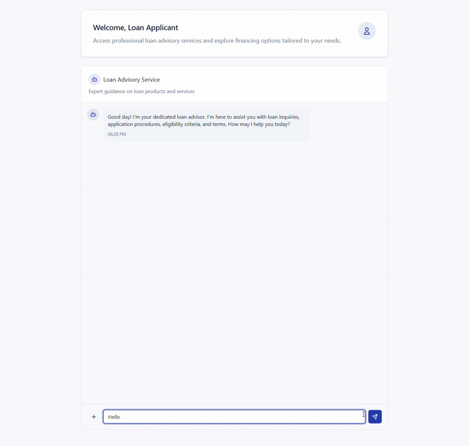

# Multi-Agent Student Loan Assistant

⭐ If you like this sample, star it on GitHub!



## Overview

A **conversational AI assistant** for student loan processing that leverages multi-agent architecture to handle loan applications through natural conversation. Users can ask questions, upload documents, and receive automated loan decisions without navigating traditional web forms.

**Powered by [Microsoft Agent Framework](https://learn.microsoft.com/en-us/agent-framework/overview/agent-framework-overview)**

**Key capabilities**:
- General Q&A about student loans
- PDF document upload (loan applications & bank statements)
- AI-powered data extraction with GPT-4o
- Automated validation and loan approval decisions
- Real-time streaming responses

## Prerequisites

**Required**:
- Azure CLI 2.80.0+ ([install](https://docs.microsoft.com/cli/azure/install-azure-cli))
- PowerShell 7+ (Windows) or Bash (Linux/macOS)
- Azure subscription with **Contributor** + **User Access Administrator** roles
- Azure OpenAI access ([request here](https://aka.ms/oai/access))

**For local development**:
- Python 3.11+
- Node.js 18+
- Docker (optional)

**Azure requirements**:
- Supported regions: `eastus`, `eastus2`, `westus`, `westus2`, `swedencentral`, `northcentralus`
- Sufficient quota for Container Apps (3), Container Registry (1), Storage (1), OpenAI (1)

**Windows users**: Set PowerShell execution policy:
```powershell
Set-ExecutionPolicy -ExecutionPolicy Bypass -Scope Process -Force
```

**Pre-deployment checklist**:
- [ ] `az login` completed
- [ ] Correct subscription selected: `az account show`
- [ ] Required RBAC roles assigned
- [ ] Azure OpenAI access approved

## 🚀 Quick Start

Run the deployment script:

```powershell
.\deploy-clean.ps1
```

**Deployment time**: ~15-20 minutes

The script provisions all resources and deploys 3 containerized services (backend API, frontend web app, MCP server) with managed identities and CORS configuration.

**Access your app**:
- Frontend: `https://<prefix>-frontend-web.azurecontainerapps.io`

**Troubleshooting**:
- Script blocked? Run: `Set-ExecutionPolicy -ExecutionPolicy Bypass -Scope Process -Force`
- OpenAI error? Try different region (e.g., `eastus`)
- Permissions issue? Request Contributor + User Access Administrator roles

## 💬 How to Interact with the Agent

Once deployed, follow these steps to process a student loan application:

### Step-by-Step Guide

**1. Greet the Agent**
   - Open the frontend application in your browser
   - Start with a friendly greeting (e.g., "Hello" or "Hi")
   - The agent will introduce itself and explain its capabilities

**2. Initiate the Application**
   - Tell the agent you're ready to apply for a student loan
   - Example: "I'd like to apply for a student loan" or "I'm ready to apply"

**3. Upload Required Documents**
   
   Upload two PDF documents:
   - **Loan Application (LA)**: Contains applicant information and loan details
   - **Bank Statement (BS)**: Contains financial transaction history
   
   > **📝 Important**: The applicant name must match exactly in both documents
   
   **Sample Documents**: Test files are available in [`src/backend/app/upload_data/`](./src/backend/app/upload_data/)


**4. Confirm Document Upload**
   - Review the uploaded files in the chat interface
   - Confirm when both documents are ready for processing

**5. Wait for OCR & Data Extraction**
   - The agent uses GPT-4o to extract structured data from your PDFs
   - This typically takes 10-30 seconds depending on document complexity
   - You'll see real-time progress updates

**6. Confirm Extracted Data**
   - Review the extracted information displayed by the agent
   - Verify accuracy and completeness
   - Confirm to proceed with loan evaluation

**7. Receive Loan Decision**
   - The agent processes your application through the approval workflow
   - Decision includes:
     - ✅ Approval status (Approved/Rejected)
     - 📊 DTI (Debt-to-Income) ratio calculation
     - 💰 Interest rate (if approved)
     - 📝 Detailed explanation of the decision

**8. End Session**
   - Thank the agent or start a new application
   - All conversation history is preserved for your reference

## Features

- Multi-agent supervisor architecture with GPT-4o
- MCP tools for business logic ([FastMCP](https://gofastmcp.com/getting-started/welcome))
- React chat UI with PDF upload
- GPT-4o document extraction (structured outputs)
- 3-tier architecture: FastAPI backend, React frontend, MCP server
- Real-time streaming (SSE)
- Automated cross-document validation


## Multi-Agent Architecture for Student Loan Processing

## System Architecture


**3-Tier Multi-Agent System**:

**🔵 Backend (FastAPI + Agent Framework)**
- Orchestration Agent: Coordinates workflow, triages requests
- Document Scanner: Extracts data from PDFs using GPT-4o
- Validator Agent: Cross-document validation, completeness checks
- Decision Maker: Calls MCP tools for loan approval
- Chat Agent: General Q&A handler

**🟢 Frontend (React + Vite)**
- Real-time chat with streaming
- PDF upload (drag-and-drop)
- Workflow status tracking

**🟡 Business API (MCP Server)**
- DTI ratio calculation
- Credit profile evaluation
- Interest rate determination

**User Flow**: Ask questions → Upload documents → Validate data → Confirm → Get loan decision

## Resources

- [Microsoft Agent Framework](https://github.com/microsoft/agent-framework)
- [Azure AI Foundry](https://learn.microsoft.com/azure/ai-foundry/what-is-azure-ai-foundry)
- [More Azure AI samples](https://aka.ms/aiapps)

**Get help**: [Azure AI Foundry Discord](https://aka.ms/foundry/discord) | [Developer Forum](https://aka.ms/foundry/forum)

## 📚 Documentation

- **[src/biz_api/loan_approval/README.md](./src/biz_api/loan_approval/README.md)**: MCP server documentation
- **[src/biz_api/loan_approval/DTI_IMPLEMENTATION.md](./src/biz_api/loan_approval/DTI_IMPLEMENTATION.md)**: DTI calculation logic
- **[src/frontend/README.md](./src/frontend/README.md)**: Frontend development guide

## 🤝 Contributing

This project welcomes contributions and suggestions. Most contributions require you to agree to a Contributor License Agreement (CLA) declaring that you have the right to, and actually do, grant us the rights to use your contribution. For details, visit [https://cla.opensource.microsoft.com](https://cla.opensource.microsoft.com/).

This project has adopted the [Microsoft Open Source Code of Conduct](https://opensource.microsoft.com/codeofconduct/). For more information see the [Code of Conduct FAQ](https://opensource.microsoft.com/codeofconduct/faq/) or contact [opencode@microsoft.com](mailto:opencode@microsoft.com) with any additional questions or comments.

## Trademarks

This project may contain trademarks or logos for projects, products, or services. Authorized use of Microsoft trademarks or logos is subject to and must follow [Microsoft's Trademark & Brand Guidelines](https://www.microsoft.com/legal/intellectualproperty/trademarks/usage/general). Use of Microsoft trademarks or logos in modified versions of this project must not cause confusion or imply Microsoft sponsorship. Any use of third-party trademarks or logos are subject to those third-party's policies.